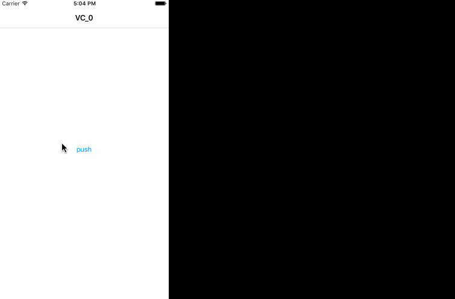

# SkyLogInDealloc
把`src/UIViewController+SkyLogInDealloc`拖到你的项目即可使用。

实现说明文章: [iOS使用runtime监测UIViewController的dealloc](http://skytoup.wicp.net/2016/02/02/iOS%E4%BD%BF%E7%94%A8runtime%E7%9B%91%E6%B5%8BUIViewController%E7%9A%84dealloc/)